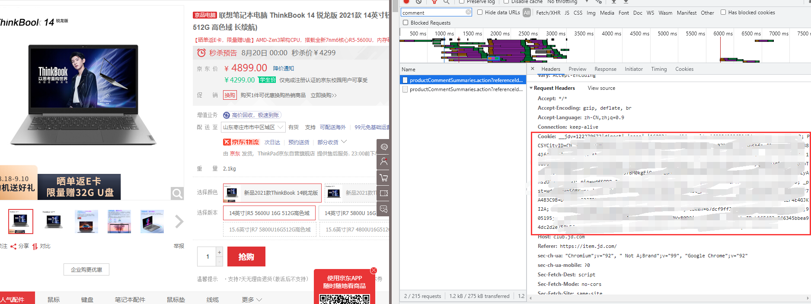
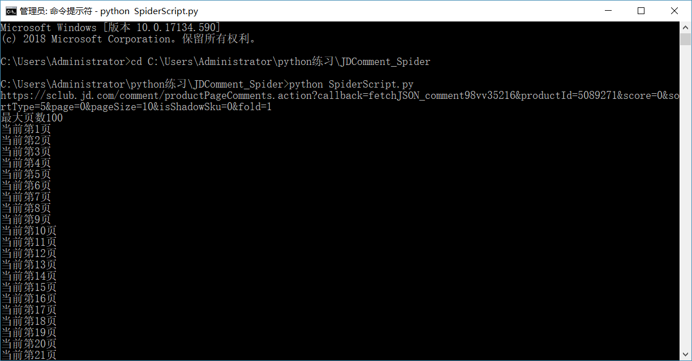

# 京东爬虫

感谢大家的star和fork，为了感谢大家的关注，特意对代码进行了优化，对最新的url格式进行了更新，减少了一些冗余的参数，希望能够帮助大家入门爬虫，已经爬好的京东手机的评论已经存储在data目录下，可以直接用于进一步分析。对项目不熟悉的可以查看[**教程**](https://blog.csdn.net/weixin_42474261/article/details/88354134?spm=1001.2014.3001.5502)。后续会重新封装几个版本，主要是添加多线程、redis缓存等机制提高爬虫效率，同时也将把核心参数打包成json方便使用。

希望你抓取顺利，同时也希望大家多多关注和支持，你们的**fork**是对我最大的认可，哈哈哈！

## 抓取评论的关键字

* 用户ID
* 评论内容
* 会员级别
* 点赞数
* 回复数
* 评价星级
* 购买时间
* 手机型号

## 抓取原理

* 分析京东评论界面数据来源及url规律

* 利用requests库访问json格式评论信息

## 运行环境

* Chrome 版本 72.0.3626.109（正式版本） （64 位）
* Python 3.5.2 :: Anaconda 4.2.0 (64-bit)

## 前置库

核心库如下

* requests
* fake_useragent
* BeautifulSoup

在当前目录下的控制台使用以下命令，批量安装上述相关的程序包

```
pip install -r requirements.txt
```

## 使用方法

### Cookie配置

以下图为例，复制控制台中Header请求中的Cookies字段内容，将其替换代码中`'your cookies'`部分，即可批量访问评论信息，有问题请留言。




### 爬取脚本SpiderScript.py

将文件下载到本地，cmd进入该文件夹，在配置好Cookie和自己想爬取的商品id后运行

`python SpiderScript.py`

即可执行爬虫脚本，当然也可以通过Pycharm、VS Code等环境直接运行该脚本。

 
(注意：在爬取数据之前，尽量确保网络的稳定，这能提高爬虫的效率，爬完所有数据，会存到data目录下的csv文件中)

### 数据处理脚本JDComment_Processing.ipynb
使用Jupyter notebook/lab打开ipynb文件，随后shift+enter逐步执行，即可看到数据处理过程(每个单元格的执行情况)

## 数据处理

在JDComment_Processing中包含了数据清洗、数据分析的整个过程（附注释与分析），使用的IDE是jupyter。数据规模有限，分析过程仅供参考。