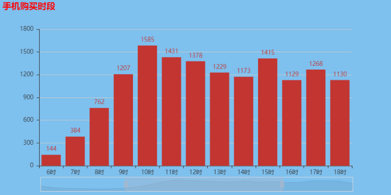
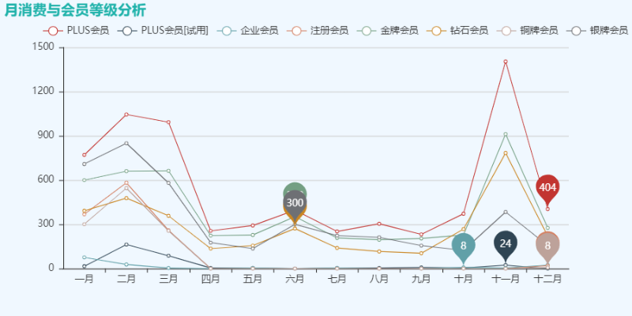

# 京东爬虫

## 抓取评论的关键字

* 用户ID
* 评论内容
* 会员级别
* 点赞数
* 回复数
* 评价星级
* 购买时间
* 手机型号

## 抓取原理

* 分析京东评论界面数据来源及url规律

* 利用requests库访问json格式评论信息

## 运行环境

* Chrome 版本 72.0.3626.109（正式版本） （64 位）
* Python 3.5.2 :: Anaconda 4.2.0 (64-bit)

## 前置库

核心库如下

* requests
* fake_useragent
* BeautifulSoup

在当前目录下的控制台使用以下命令，批量安装上述相关的程序包

```
pip install -r requirements.txt
```

## 使用方法

### 环境

配置代理的终端可以直接使用
`pip install -r requirements`
觉得下载速度慢，可以使用清华镜像源下载相关依赖
`pip install -r requirements -i https://pypi.tuna.tsinghua.edu.cn/simple`

### 运行脚本SpiderScript.py
将文件下载到本地，cmd进入该文件夹

 
(注意：在爬取数据之前，尽量确保网络的稳定，这能提高爬虫的效率，爬完所有数据，会存到data目录下的csv文件中)

### 数据分析脚本JDComment_Processing.ipynb

使用Jupyter notebook/lab打开ipynb文件，随后shift+enter逐步执行，即可看到数据处理过程(每个单元格的执行情况)。

分析借助柱状图和词云图来展现手机消费时段以及热点评论词，效果如下

时段分析
[](https://github.com/YuleZhang/JDComment_Spider/blob/master/picture/%E6%89%8B%E6%9C%BA%E8%B4%AD%E4%B9%B0%E6%97%B6%E6%AE%B5.png)

词云图


会员分析


## 数据处理过程

[content](./数据库报告.pdf)

## 声明

如果图片或pdf显示不出来，可以参考[CSDN链接](https://blog.csdn.net/qq_41709370/article/details/106282229)查看，或者直接下载项目，本地查看。

本项目是个人使用而开发，目的纯粹出于个人兴趣和学习，不包含任何商业用途。本人深知创意和知识产权的重要性，因此强调此项目的使用范围仅限于非商业目的。

大家在使用过程中，如果遇到任何问题或有改进建议，直接通过项目的“问题(issue)”板块提出。我及时关注并作出必要的修改，以确保项目的持续改进。

非常感谢社区的每一位用户和贡献者，期待与您的互动！
